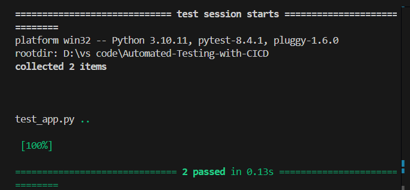

# 📘 Automated Testing with CI/CD

## 📌 Overview

This project demonstrates a **simple Python application** with **unit tests** automated through a **GitHub Actions CI/CD pipeline**.
Every code push triggers the pipeline, runs the test suite, and ensures continuous quality checks.

---

## 🛠 Tech Stack

* **Python 3.9**
* **Pytest** (unit testing framework)
* **GitHub Actions** (CI/CD automation)

---

## 📂 Project Structure

```
.
├── app.py              # Simple Python application
├── test_app.py         # Unit tests
└── .github/workflows/ci.yml   # GitHub Actions workflow
```

---

## 🚀 Setup Instructions

### Run Locally

1. Clone the repo:

   ```bash
   git clone https://github.com/<your-username>/oracle-qa-ci.git
   cd oracle-qa-ci
   ```
2. Install dependencies:

   ```bash
   pip install pytest
   ```
3. Run tests:

   ```bash
   pytest
   ```

### Run on CI/CD (GitHub Actions)

* On every **git push**, the workflow runs:

  1. Checkout code
  2. Setup Python
  3. Install Pytest
  4. Run tests

✅ If tests pass, the build shows as **green (passing)**.

---

## 🔄 CI/CD Workflow

**`.github/workflows/ci.yml`**

```yaml
name: Python CI

on: [push]

jobs:
  build:
    runs-on: ubuntu-latest
    steps:
      - name: Checkout repository
        uses: actions/checkout@v2

      - name: Set up Python
        uses: actions/setup-python@v2
        with:
          python-version: 3.9

      - name: Install dependencies
        run: pip install pytest

      - name: Run Tests
        run: pytest --maxfail=1 --disable-warnings -q
```

---

## 📊 Sample Output

```
collected 2 items
test_app.py ..                                     [100%]
```

✅ Build Passing — tests succeed on every push.
